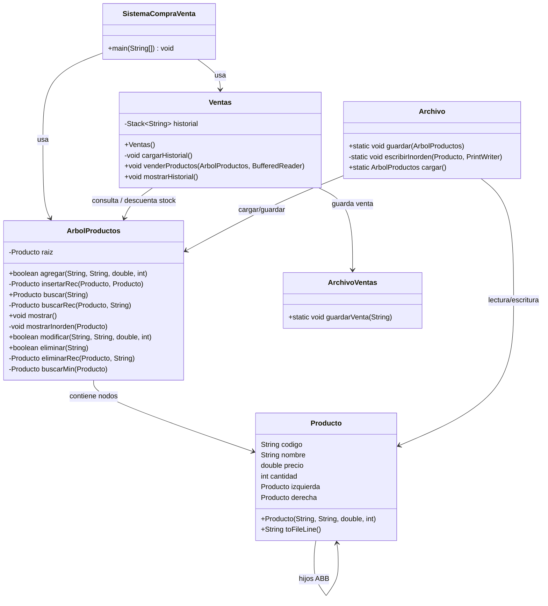

```mermaid
classDiagram
    direction TB

    class SistemaCompraVenta {
        +main(String[]) void
    }

    class ArbolProductos {
        -Producto raiz
        +boolean agregar(String, String, double, int)
        -Producto insertarRec(Producto, Producto)
        +Producto buscar(String)
        -Producto buscarRec(Producto, String)
        +void mostrar()
        -void mostrarInorden(Producto)
        +boolean modificar(String, String, double, int)
        +boolean eliminar(String)
        -Producto eliminarRec(Producto, String)
        -Producto buscarMin(Producto)
    }

    class Producto {
        String codigo
        String nombre
        double precio
        int cantidad
        Producto izquierda
        Producto derecha
        +Producto(String, String, double, int)
        +String toFileLine()
    }

    class Ventas {
        -Stack~String~ historial
        +Ventas()
        -void cargarHistorial()
        +void venderProductos(ArbolProductos, BufferedReader)
        +void mostrarHistorial()
    }

    class Archivo {
        +static void guardar(ArbolProductos)
        -static void escribirInorden(Producto, PrintWriter)
        +static ArbolProductos cargar()
    }

    class ArchivoVentas {
        +static void guardarVenta(String)
    }

    SistemaCompraVenta --> ArbolProductos : usa
    SistemaCompraVenta --> Ventas : usa
    ArbolProductos --> Producto : contiene nodos
    Ventas --> ArbolProductos : consulta / descuenta stock
    Ventas --> ArchivoVentas : guarda venta
    Archivo --> ArbolProductos : cargar/guardar
    Archivo --> Producto : lectura/escritura
    Producto --> Producto : hijos ABB
```
